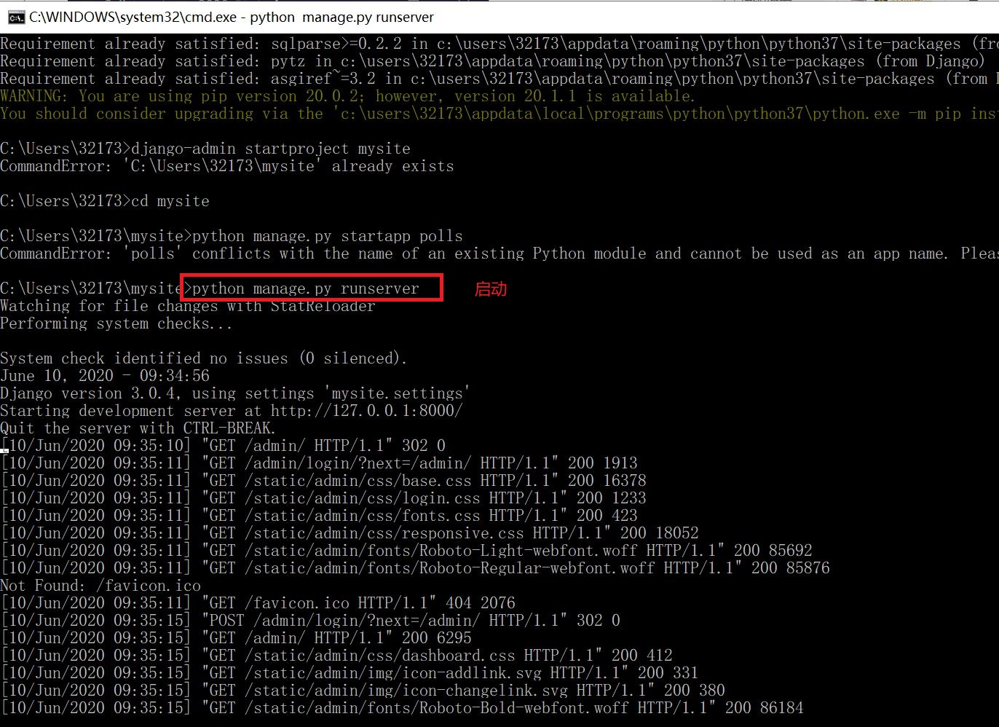
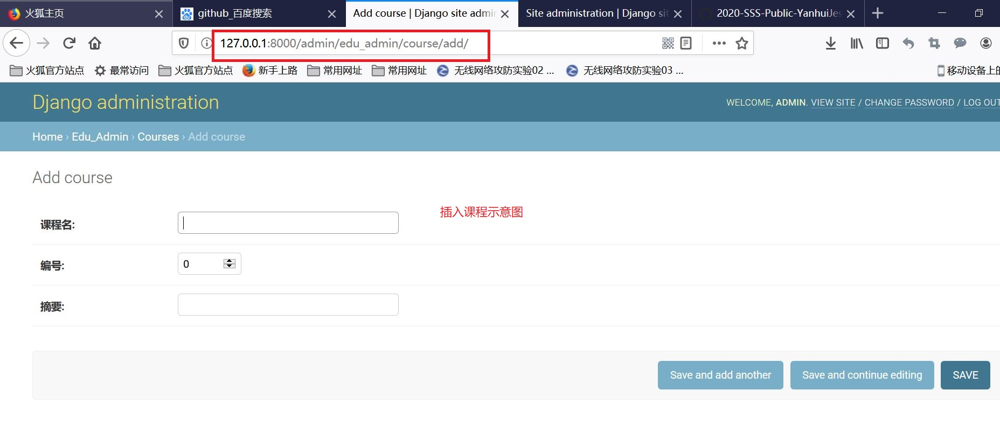
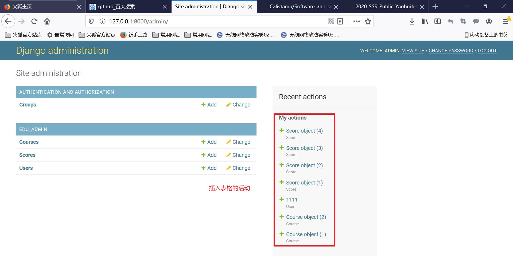
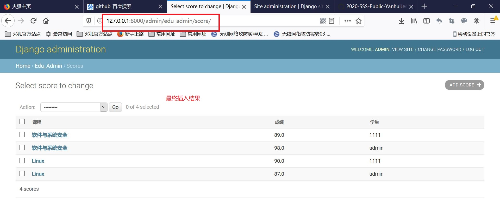
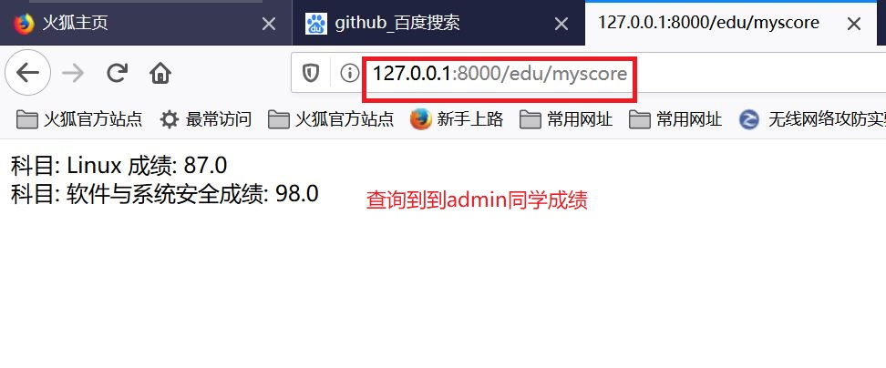

Web开发
---
## 实验目的：
- 以Django为例，进行Web开发，开发一个简易教务系统，包括选课以及成绩查询；

## 实验过程：    
### 1.安装启动Django    
```
python -m pip install --upgrade pip
pip install Django
django-admin startproject mysite
cd  mysite
python manage.py startapp polls
python manage.py runserver
```

### 2.编写教务系统：
- 打开edu_admin中的models.py文件，定义课程、学生、成绩三表：
```
from django.db import models
from django.contrib.auth.models import AbstractUser

class Course(models.Model):
    name = models.CharField(verbose_name='课程名',  max_length=100)
    number = models.IntegerField(verbose_name='编号', default=0)
    summary = models.CharField(verbose_name='摘要', max_length=500, null=True)


class Student(models.Model):
    class_name = models.CharField(verbose_name="班级", max_length=100, blank=True, null=True)
    name = models.CharField(verbose_name="姓名", max_length=100, blank=True, null=True)
    number = models.IntegerField(verbose_name="学号", default=0)
    phone_number = models.CharField(verbose_name='手机号', max_length=11,null=True)

class Score(models.Model):
    course = models.ForeignKey(Course, verbose_name='课程', on_delete=models.CASCADE, related_name='students')
    student = models.ForeignKey(Student, verbose_name='学生', on_delete=models.CASCADE, related_name='my_courses')
    score = models.FloatField(verbose_name='成绩',  null=True)
```

```
urls.py文件:
from django.urls import path

from .views import *

urlpatterns = [
    path('index/<int:pk>',index),
]
```

```
view.py
from django.contrib.auth.decorators import login_required
from django.shortcuts import render

from django.http import HttpResponse

# 从models中导入模型类,然后调用这个模型类的objects的filter方法，就完成了一次sql select
from .models import Score 

def index(request,pk):
    return HttpResponse('<html><body>hello world %d </body></html>' % pk)

# Create your views here.

@login_required
def my_score(request):
    # filter函数的参数是就相当于查询的过滤条件
    # 要查询的是 student为当前登录用户的Score表的记录
    result=Score.objects.filter(student=request.user)
    return render(request,'score.html',{'result':result})
```

```
admin.py
from django.contrib import admin

from .models import Student, Course, Score

class ScoreAdmin(admin.ModelAdmin):
    list_display=('course','score','student')

admin.site.register(Student)
admin.site.register(Course)
admin.site.register(Score,ScoreAdmin)
# Register your models here.
```

- 访问 http://127.0.0.1:8000/admin/ 刚才新建的用户登录后看到这个页面。可以录入一些课程，学生，和成绩（下图是我录入的一些测试数据）：



- 在edu下新建templates目录，下面新建score.html：
```
<html>
<body>

科目： {{ i.course.name }}
成绩： {{ i.score }}
<br>

</body>
</html>
```

```
修改urls.py:
urlpatterns = [
    path('index/<int:pk>',index),
    path('myscore',my_score)
]
```
- 访问 http://127.0.0.1:8000/edu/myscore ，可以看到成绩（此时查询的是当前登录成员admin同学的成绩，该同学为设定的超级管理员）:


## 实验参考资料：
- [实验报告](https://github.com/Great-Lin999/SoftwareAndSystemSecurity/blob/master/SQL%E6%B3%A8%E5%85%A5/SQL%E6%B3%A8%E5%85%A5.md)


