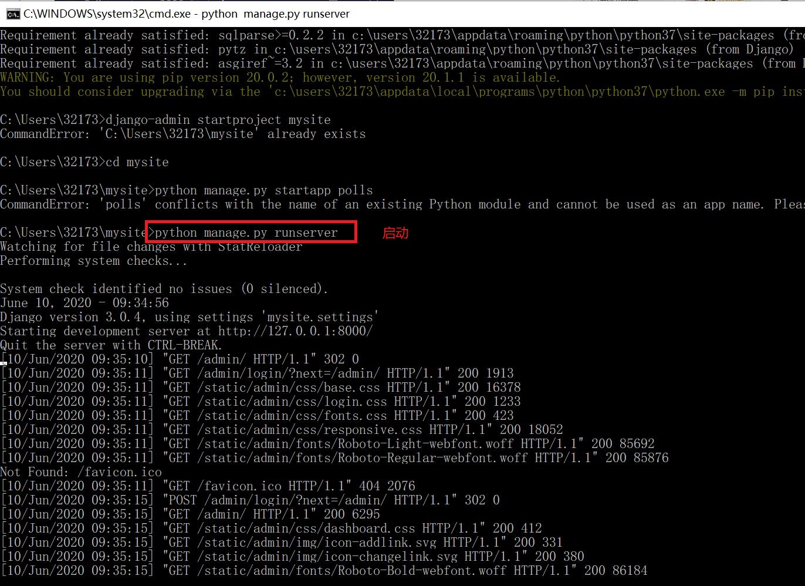
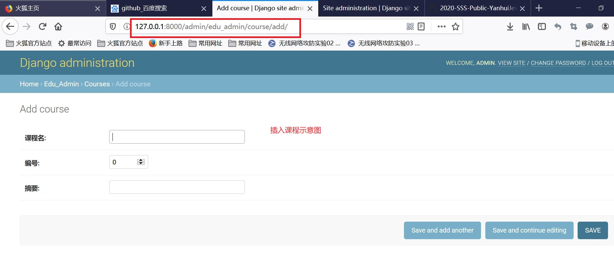
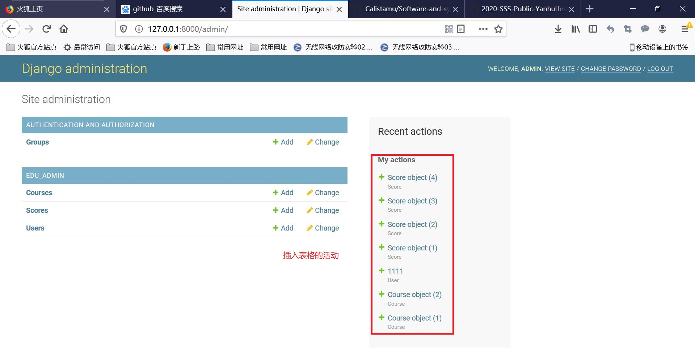
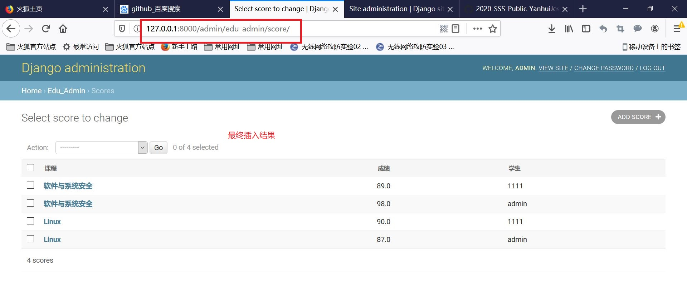
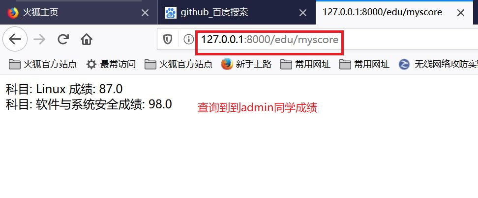
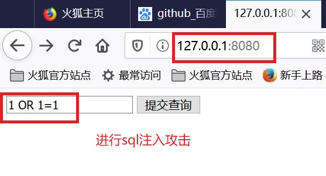
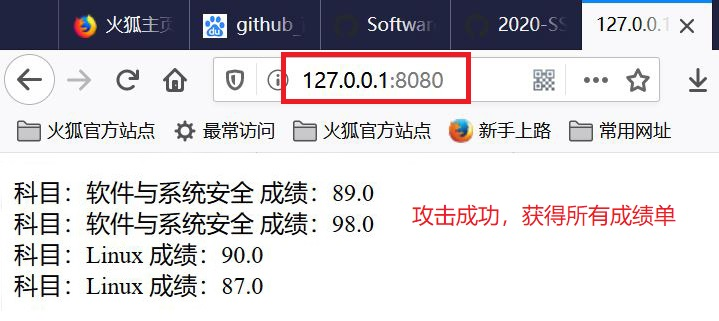

SQL注入
---
## 实验目的：
- 以Django为例，进行Web开发，开发一个简易教务系统，包括选课以及成绩查询；
- 使用sql_injection.py文件对教务系统进行sql注入攻击。
## 实验过程：    
### 1.安装启动Django    
```
python -m pip install --upgrade pip
pip install Django
django-admin startproject mysite
cd  mysite
python manage.py startapp polls
python manage.py runserver
```

### 2.编写教务系统：
- 打开edu_admin中的models.py文件，定义课程、学生、成绩三表：
```
from django.db import models
from django.contrib.auth.models import AbstractUser

class Course(models.Model):
    name = models.CharField(verbose_name='课程名',  max_length=100)
    number = models.IntegerField(verbose_name='编号', default=0)
    summary = models.CharField(verbose_name='摘要', max_length=500, null=True)


class Student(models.Model):
    class_name = models.CharField(verbose_name="班级", max_length=100, blank=True, null=True)
    name = models.CharField(verbose_name="姓名", max_length=100, blank=True, null=True)
    number = models.IntegerField(verbose_name="学号", default=0)
    phone_number = models.CharField(verbose_name='手机号', max_length=11,null=True)

class Score(models.Model):
    course = models.ForeignKey(Course, verbose_name='课程', on_delete=models.CASCADE, related_name='students')
    student = models.ForeignKey(Student, verbose_name='学生', on_delete=models.CASCADE, related_name='my_courses')
    score = models.FloatField(verbose_name='成绩',  null=True)
```

```
urls.py文件:
from django.urls import path

from .views import *

urlpatterns = [
    path('index/<int:pk>',index),
]
```

```
view.py
from django.contrib.auth.decorators import login_required
from django.shortcuts import render

from django.http import HttpResponse

# 从models中导入模型类,然后调用这个模型类的objects的filter方法，就完成了一次sql select
from .models import Score 

def index(request,pk):
    return HttpResponse('<html><body>hello world %d </body></html>' % pk)

# Create your views here.

@login_required
def my_score(request):
    # filter函数的参数是就相当于查询的过滤条件
    # 要查询的是 student为当前登录用户的Score表的记录
    result=Score.objects.filter(student=request.user)
    return render(request,'score.html',{'result':result})
```

```
admin.py
from django.contrib import admin

from .models import Student, Course, Score

class ScoreAdmin(admin.ModelAdmin):
    list_display=('course','score','student')

admin.site.register(Student)
admin.site.register(Course)
admin.site.register(Score,ScoreAdmin)
# Register your models here.
```

- 访问 http://127.0.0.1:8000/admin/ 刚才新建的用户登录后看到这个页面。可以录入一些课程，学生，和成绩（下图是我录入的一些测试数据）：



- 在edu下新建templates目录，下面新建score.html：
```
<html>
<body>

科目： {{ i.course.name }}
成绩： {{ i.score }}
<br>

</body>
</html>
```

```
修改urls.py:
urlpatterns = [
    path('index/<int:pk>',index),
    path('myscore',my_score)
]
```
- 访问 http://127.0.0.1:8000/edu/myscore ，可以看到成绩（此时查询的是当前登录成员admin同学的成绩，该同学为设定的超级管理员）:


### 3.进行sql注入攻击：

```
sql_injection.py：
# -*- coding: utf-8 -*-

import sys
import cgi
from http.server import HTTPServer, BaseHTTPRequestHandler


class MyHTTPRequestHandler(BaseHTTPRequestHandler):
    field_name = 'a'
    form_html = \
        '''
        <html>
        <body>
        <form method='post' enctype='multipart/form-data'>
        <input type='text' name='%s'>
        <input type='submit'>
        </form>
        </body>
        </html>
        ''' % field_name

    def do_GET(self):
        self.send_response(200)
        self.send_header("Content-type", "text/html")
        self.end_headers()
        self.wfile.write(self.form_html.encode())


    def do_POST(self):
        form_data = cgi.FieldStorage(
            fp=self.rfile,
            headers=self.headers,
            environ={
                'REQUEST_METHOD': 'POST',
                'CONTENT_TYPE': self.headers['Content-Type'],
            })
        fields = form_data.keys()
        if self.field_name in fields:
            input_data = form_data[self.field_name].value
            # 单表查询，只显示pk，不显示课程名。
            #sql = 'SELECT course_id, score FROM edu_admin_score WHERE student_id = %s' % input_data
            # 多表查询，通过成绩表中课程fk查出课程名。
            sql = 'SELECT edu_admin_course.name, edu_admin_score.score FROM edu_admin_score INNER JOIN edu_admin_course ON edu_admin_score.course_id=edu_admin_course.id WHERE student_id = %s ' % input_data

            import sqlite3
            conn = sqlite3.connect('db.sqlite3')
            c = conn.cursor()
            query_result = c.execute(sql)
            response_content = ''
            for i in query_result:
                #response_content += '科目： %i 成绩： %.2f <br>' % i
                response_content += '科目： %s 成绩： %.2f <br>' % i
            conn.close()

            self.send_response(200)
            self.send_header("Content-type", "text/html;charset=utf-8")
            self.end_headers()
            self.wfile.write(( "<html><body>%s</body></html>" %response_content ).encode('UTF-8') )


class MyHTTPServer(HTTPServer):
    def __init__(self, host, port):
        print("run app server by python!")
        HTTPServer.__init__(self,  (host, port), MyHTTPRequestHandler)


if '__main__' == __name__:
    server_ip = "0.0.0.0"
    server_port = 8080
    if len(sys.argv) == 2:
        server_port = int(sys.argv[1])
    if len(sys.argv) == 3:
        server_ip = sys.argv[1]
        server_port = int(sys.argv[2])
    print("App server is running on http://%s:%s " % (server_ip, server_port))

    server = MyHTTPServer(server_ip, server_port)
    server.serve_forever()

```
- 运行文件后，访问http://127.0.0.1:8080/，会出现一个编辑框，输入学生ID可以查询对应的成绩，这时提交```1 OR 1= 1```,查出了当前系统中所有用户的成绩,相当于获得了整个数据库:




- 攻击原理：    
问题在代码的43行，我们直接把用户输入的数据，作为sql语句中的查询条件。最后的 sql语句为：
```
SELECT edu_admin_course.name, edu_admin_score.score FROM edu_admin_score INNER JOIN edu_admin_course ON edu_admin_score.course_id=edu_admin_course.id WHERE student_id = 1 OR 1=1
```
  查询条件变成了```student_id = 1 OR 1=1```,```1=1```恒为真， 任何数OR真值，也是真。所以，相当于
```
SELECT edu_admin_course.name, edu_admin_score.score FROM edu_admin_score INNER JOIN edu_admin_course ON edu_admin_score.course_id=edu_admin_course.id WHERE true;
```
  或者没有WHERE,变成了无条件查询,于是显示出了数据中的所有记录。
## 实验总结：
- 在软件安全中，有一个原则，所有用户的输入都是不可信的。因此，我们必须对用户输入进行过滤、严格的限制。
## 实验参考资料：
- https://github.com/Great-Lin999/SoftwareAndSystemSecurity/blob/master/SQL%E6%B3%A8%E5%85%A5/SQL%E6%B3%A8%E5%85%A5.md


