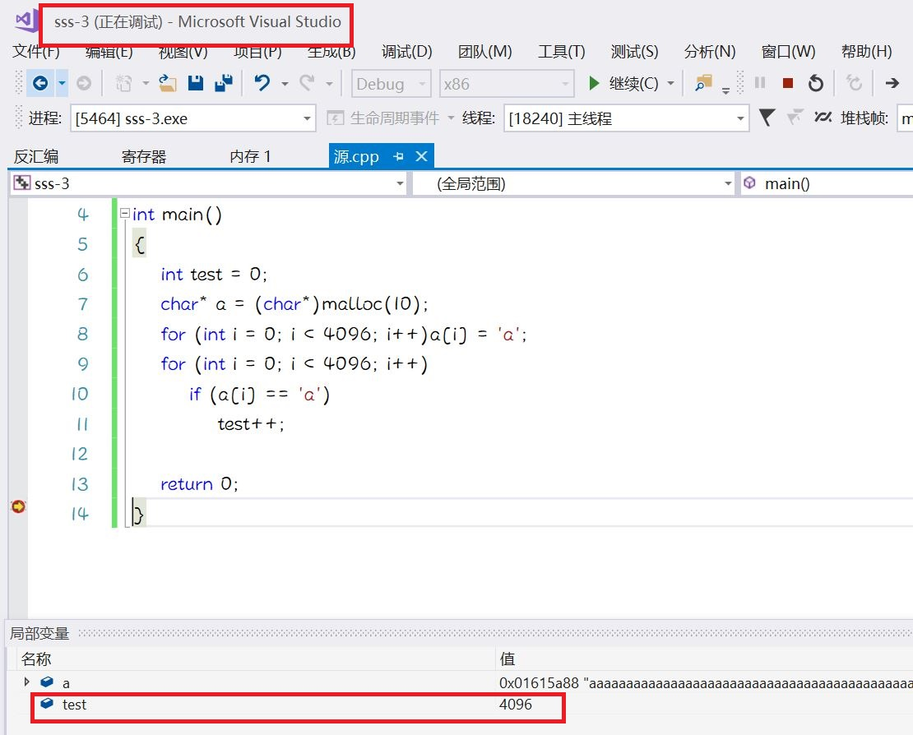
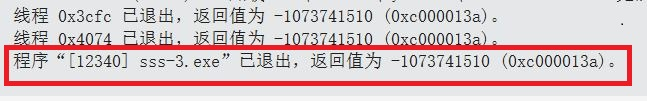
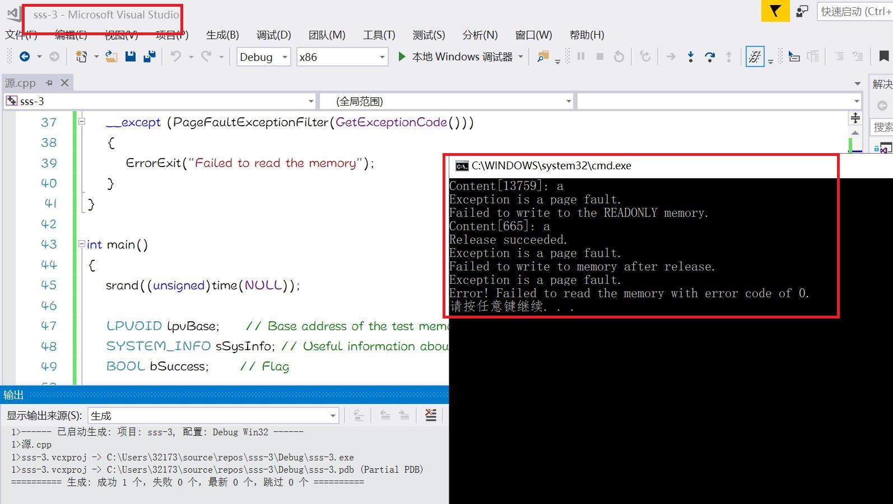

内存管理
---
## 实验目的：
- 阅读VirtualAlloc、VirtualFree、VirtualProtect等函数的官方文档。
- 编程使用malloc分配一段内存，测试是否这段内存所在的整个4KB都可以写入读取。
- 使用VirtualAlloc分配一段，可读可写的内存，写入内存，然后将这段内存改为只读，再读数据和写数据，看是否会有异常情况。然后VirtualFree这段内存，再测试对这段内存的读写释放正常。
## 实验过程：
### 1.malloc
- 打开Visual Studio2017，写入以下测试代码：
```
#include <stdio.h>  /* printf, scanf, NULL */
#include <stdlib.h>  /* malloc, free, rand, system */

int main()
{
	int test = 0;
	char* a = (char*)malloc(10);
	for (int i = 0; i < 4096; i++)a[i] = 'a';
	for (int i = 0; i < 4096; i++)
		if (a[i] == 'a')
			test++;

	return 0;
}
```
- 设置断点，调试运行结果如下：


- 实验一总结说明：
    - CHAR 类型数据占 1 个字节，4KB 为 4096 个字节，系统以 4KB 为单位管理内存，虽然只分配了 10 个字节，但这 10 个字节所在的 4KB 区域都可以写入（test值为4096），但是由于溢出的数据过多覆盖了其他正常的数据，所以会导致程序无法正常退出。
 ### 2.VirtualAlloc VirtualFree
 - 使用 VirtualAlloc 分配一段可读可写的内存，返回值为分配内存页的首地址：
 ```
  lpvBase = VirtualAlloc(
            NULL,	// System selects address
            PAGELIMIT * dwPageSize,	// 分配的大小
            MEM_COMMIT|MEM_RESERVE,	// To reserve and commit pages in one step
            PAGE_READWRITE	// 可读可写
        );
 ```
 - 使用 VirtualProtect 修改一段内存的访问属性，修改成功返回值非0，修改失败返回0:
 ```
 bSuccess = VirtualProtect(
            lpvBase,
            PAGELIMIT * dwPageSize,	// 需要改变访问属性的区域大小
            PAGE_READONLY,		// 只读
            &oldProtect	// 在修改前，旧的访问属性将被存储
        );
 ```
 - 使用 VirtualFree 释放一段内存,如果 dwFreeType 参数的值为 MEM_RELEASE，dwSize 参数的值必须为0，函数将释放 VirtualAlloc 初始保留的整个区域:
 ```
 bSuccess = VirtualFree(
            lpvBase,       // Base address of block
            0,             // dwSize
            MEM_RELEASE);  // dwFreeType
        printf("Release %s.\n", bSuccess ? "succeeded" : "failed");
 ```
 - 以下是完整测试代码：
 ```
 #include<windows.h>
#include<stdio.h>
#include<stdlib.h>
#include<time.h>

#define PAGELIMIT 5 // Number of pages to ask for

DWORD dwPageSize;       // Page size on this computer
LPTSTR lpPtr;       // Generic character pointer

int PageFaultExceptionFilter(DWORD dwCode)
{
	// If the exception is not a page fault, exit.
	if (dwCode != EXCEPTION_ACCESS_VIOLATION)
	{
		printf("Exception code = %d.\n", dwCode);
		return EXCEPTION_EXECUTE_HANDLER;
	}
	printf("Exception is a page fault.\n");
	return EXCEPTION_EXECUTE_HANDLER;
}

void ErrorExit(LPTSTR lpMsg)
{
	printf("Error! %s with error code of %ld.\n", lpMsg, GetLastError());
	exit(0);
}

void ReadTest()
{
	__try
	{
		// 访问页内随机地址
		int add = rand() % (PAGELIMIT * dwPageSize);
		printf("Content[%d]: %c\n", add, lpPtr[add]);
	}
	__except (PageFaultExceptionFilter(GetExceptionCode()))
	{
		ErrorExit("Failed to read the memory");
	}
}

int main()
{
	srand((unsigned)time(NULL));

	LPVOID lpvBase;     // Base address of the test memory
	SYSTEM_INFO sSysInfo;	// Useful information about the system
	BOOL bSuccess;      // Flag

	GetSystemInfo(&sSysInfo);     // Initialize the structure.

	dwPageSize = sSysInfo.dwPageSize;

	lpvBase = VirtualAlloc(
		NULL,	// System selects address
		PAGELIMIT * dwPageSize,	// 分配的大小
		MEM_COMMIT | MEM_RESERVE,	// To reserve and commit pages in one step
		PAGE_READWRITE	// 可读可写
	);
	if (lpvBase == NULL)
		ErrorExit("VirtualAlloc reserve failed");

	lpPtr = (LPTSTR)lpvBase;

	for (unsigned int i = 0; i < PAGELIMIT * dwPageSize; i++)
	{
		__try
		{
			lpPtr[i] = 'a';	// 写入内存
		}
		__except (PageFaultExceptionFilter(GetExceptionCode()))
		{
			ErrorExit("Failed to write to memory");
		}
	}

	ReadTest();

	DWORD oldProtect;
	bSuccess = VirtualProtect(
		lpvBase,
		PAGELIMIT * dwPageSize,	// 需要改变访问属性的区域大小
		PAGE_READONLY,		// 只读
		&oldProtect	// 在修改前，旧的访问属性将被存储
	);

	if (bSuccess == 0)
		ErrorExit("Change access protection attributes failed");

	for (unsigned int i = 0; i < PAGELIMIT * dwPageSize; i++)
	{
		__try
		{
			lpPtr[i] = 'b';	// 写入内存
		}
		__except (PageFaultExceptionFilter(GetExceptionCode()))
		{
			printf("Failed to write to the READONLY memory.\n");
			break;
		}
	}

	ReadTest();

	bSuccess = VirtualFree(
		lpvBase,       // Base address of block
		0,             // Bytes of committed pages
		MEM_RELEASE);  // Decommit the pages
	printf("Release %s.\n", bSuccess ? "succeeded" : "failed");

	for (unsigned int i = 0; i < PAGELIMIT * dwPageSize; i++)
	{
		__try
		{
			lpPtr[i] = 'c';	// 写入内存
		}
		__except (PageFaultExceptionFilter(GetExceptionCode()))
		{
			printf("Failed to write to memory after release.\n");
			break;
		}
	}

	ReadTest();
}
 ```
 - 运行结果如下：
 
 - 实验结果分析：
     - 由 VirtualAlloc 分配的 PAGE_READWRITE（可读可写）内存可以正常的写入和读取；
     - 将访问属性修改为 PAGE_READONLY 后，该段内存无法写入，但可以正常读取；
     - 使用 VirtualFree 之后，该段内存无法进行写入和读取；
  
  ## 参考资料：
  - [VirtualAlloc](https://docs.microsoft.com/zh-cn/windows/win32/api/memoryapi/nf-memoryapi-virtualalloc)  
  - [VirtualFree](https://docs.microsoft.com/en-us/windows/win32/api/memoryapi/nf-memoryapi-virtualfree)
  - [VirtualProtect](https://docs.microsoft.com/en-us/windows/win32/api/memoryapi/nf-memoryapi-virtualprotect)
  - [实验报告](https://github.com/chencwx/Software-and-system-security/tree/master/%E7%BC%93%E5%AD%98%E5%8C%BA%E6%BA%A2%E5%87%BA%E6%BC%8F%E6%B4%9E)
  - [实验报告](https://github.com/YanhuiJessica/2020-SSS-Public-YanhuiJessica/blob/master/lab0x03%20Memory/README.md)