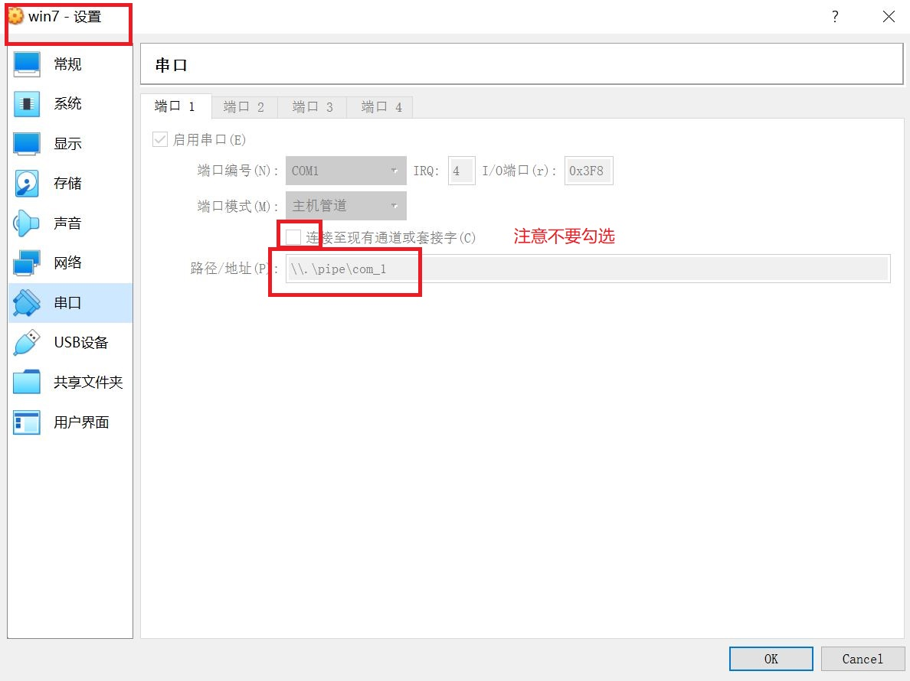

内存管理+windbg
---
## 实验要求：
- 验证不同进程的相同的地址可以保存不同的数据：
    - (1) 在VS中，设置固定基地址，编写两个不同可执行文件，同时运行这两个文件，然后使用调试器附加到两个程序的进程，查看内存，看两个程序是否使用了相同的内存地址； 
    - (2) 在不同的进程中，尝试使用VirtualAlloc分配一块相同地址的内存，写入不同的数据，再读出。
- (难度较高)配置一个Windbg双机内核调试环境，查阅Windbg的文档，了解 ：
    - (1) Windbg如何在内核调试情况下看物理内存，也就是通过物理地址访问内存；
    - (2) 如何查看进程的虚拟内存分页表，在分页表中找到物理内存和虚拟内存的对应关系，然后通过Windbg的物理内存查看方式和虚拟内存的查看方式，看同一块物理内存中的数据情况。
## 实验环境：
- Windows10 
- Windows7
## 实验过程：
### 实验一
#### 在VS中，设置固定基地址，编写两个不同可执行文件。同时运行这两个文件。然后使用调试器附加到两个程序的进程，查看内存，看两个程序是否使用了相同的内存地址；
- 先编写两个不同的可执行文件test01,test02：
   ```c
  //test01
  #include<stdio.h>
  int main()
  {
  	printf("1");
  }

  //test02
  #include<stdio.h>
  int main()
  {
  	printf("2");
  }
  ```
- 设置固定基址：
  - 两个项目的基地址都设置为0x40000000：
     
  
- 设置断点，调试，右键转到反汇编，可观察到：两个项目使用的是相同的内存地址，即不同进程的相同的地址可以保存不同的数据：  
         
#### 在不同的进程中，尝试使用VirtualAlloc分配一块相同地址的内存，写入不同的数据。再读出：
  - 新建两个项目，写入以下代码，两段代码写入的内存地址完全相同但写入的内容不同：
    - 代码：
 ```
#include <windows.h>
#include<stdio.h>
void main()
{
	int i;
	//分配内存，标记为提交、可读可写 

	LPVOID lpvBase = VirtualAlloc(
		(LPVOID)0x4000000,                 // system selects address
		1024,     // size of allocation
		MEM_COMMIT,   // allocate reserved pages
		PAGE_READWRITE
	);       // protection = no access   
	lpvBase = VirtualAlloc(
		lpvBase,                 // system selects address
		1024,     // size of allocation
		MEM_COMMIT,   // allocate reserved pages
		PAGE_READWRITE
	);
	if (lpvBase == NULL)
		return;
	//向该内存里面写些东西
	unsigned char *ustr = (unsigned char *)lpvBase;
	for (i = 0; i < 5; i++)
	{
		ustr[i] = 'a'; //test01中为'a'，test02中改为ustr[i] = 'b'
	}
	for (i = 0; i < 5; i++)
	{
		printf("%c ：%x \n", ustr[i], &ustr[i]);
	}
}
```    
 
  - 设置断点，调试，结果如下
    - 第一个项目：  
             
    - 第二个项目：  
      
    - 循环完毕结果:  
            
  - 可以发现两个项目存入的地址空间都是一样的，但是存入的值不同，一个为a，一个为b，即相同内存地址存入了不同的数据，证明不同进程相同内存地址可以保存不同的数据。
### 实验二
- windbg双机内核调试
- 实验思路：主机win10下载windbg，虚拟机vbox下载win7虚拟机，使用虚拟串口和host pipe连接的方式，让被调试的系统和windbg链接，进行调试
- 环境搭建：  
    - 虚拟机win7配置如下：
    - [win7镜像下载](https://msdn.itellyou.cn/)  
    
    - 启动虚拟机，以管理员身份进入cmd，进行如下操作：  
    
    - 重启系统，开机时选择open【启用调试程序】，系统正常启动：  
    
    - 主机windbg配置如下：
    - [windbg下载](https://developer.microsoft.com/zh-cn/windows/downloads/windows-10-sdk/)
    - 找到windbg.exe在主机中的位置：  
      
    - 在该位置下打开cmd，进行如下操作打开windbg：  
      
    - 在windbg上方状态栏选择 Debug>Break，虚拟机和windbg连接：  
      
    - 配置windbg的符号下载地址：File>Symbol File Path，进行如下操作：  
      
    - 在下方输入.reload,出现如下报错：  
      
    - 输入以下命令查找问题：  
      
    - 上网查找报错原因：  
      
    - 查找解决办法：
    [WinDbg 符号下载错误解决方案](https://blog.csdn.net/xiangbaohui/article/details/103832850)  
    按照教程进行操作后，依旧出现报错：  
      
    咨询同学后得知，解决这个问题需要科学上网，由于没有购买相应的vpn，这里以后的实验过程用图参考赵紫如同学的实验报告！
- 实验过程：
    1. 使用windbg查看保护模式分页机制下的物理地址（x64 4kb）：
    - 寻址原理参考[匠心 x64 结构体系下的内存寻址](https://blog.csdn.net/farmwang/article/details/52015991)  
    - windbg>Debug>go
    - 虚拟机中打开notepad.exe,写入helloworld：  
      
    - windbg>Bebug>break
    - 以下是我手动分析过程，借用赵紫如同学的图0-图4：  
      
      
      
      
      
      
    
    2. 查看进程虚拟内存分页表：  
    - 实验原理：虚拟地址通过pte指令找到pfn（页帧号），页帧有唯一的物理地址，将该地址x1000，加上页内偏移，得到物理地址；
    - 以下是我手动分析的过程，借用赵紫如同学的图5-图6：  
      
      
      
     
## 实验中遇到的问题：
- [HTTP STATUS错误报码对照表](https://blog.csdn.net/qq_24739457/article/details/83989222)
## 参考资料：
- [实验报告](https://github.com/purplezi/Software-and-System-Security/tree/master/hw-0x05-Memory%20Management%20(Hard%20version)

