KLEE
---
## 实验要求：
- 安装KLEE，完成官方tutorials
- 至少完成前三个
## 实验环境：
- Ubuntu 16 server
- Virtual Box
## 实验准备：
- 安装docker 
  ```
    #更新apt包索引：
    $ sudo apt-get update
    #安装以下包以使apt可以通过HTTPS使用存储库（repository）：
    $ sudo apt-get install -y apt-transport-https ca-certificates curl software-properties-common
    #添加Docker官方的GPG密钥：
    $ curl -fsSL https://download.docker.com/linux/ubuntu/gpg | sudo apt-key add -
    #使用下面的命令来设置stable存储库：
    $ sudo add-apt-repository "deb [arch=amd64] https://download.docker.com/linux/ubuntu $(lsb_release -cs) stable"
    #再更新一下apt包索引：
    $ sudo apt-get update
    #安装最新版本的Docker CE：
    $ sudo apt-get install -y docker-ce
    ```
- 查看docker服务是否启动：$ systemctl status docker
  - 可见已经成功启动    
    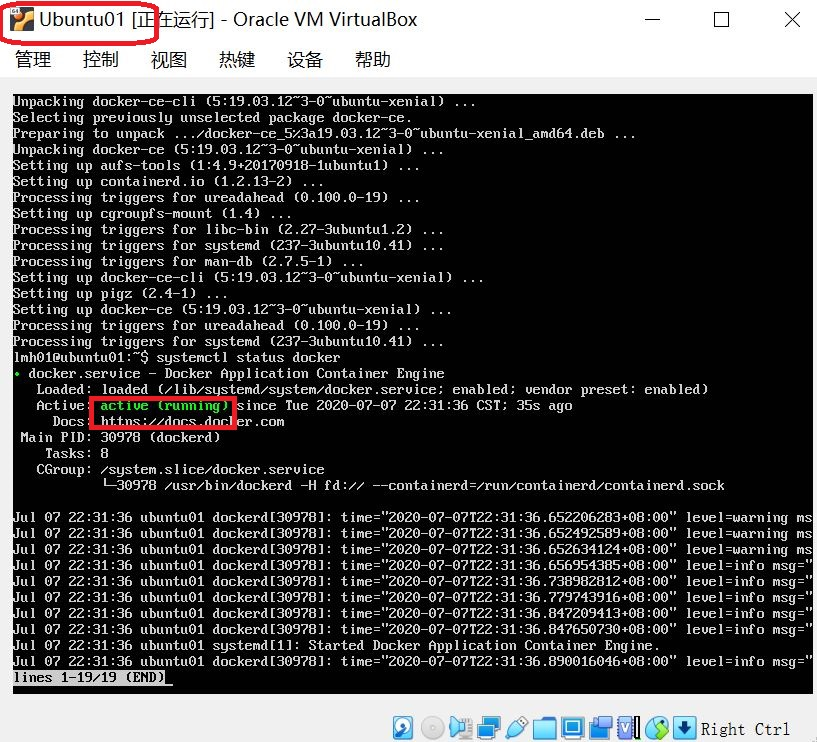  
- 在docker中安装klee
    ```
    # 安装 KLEE
    docker pull klee/klee:2.0
    ```
    - 发现一直报错连接不上，解决方法：
      - 在 /etc/docker/daemon.json 文件中添加以下参数（没有该文件则新建）：
      ```
       {
           "registry-mirrors": ["https://pee6w651.mirror.aliyuncs.com"]
       }
       ```
      - 服务重启
      ```
      systemctl daemon-reload
      systemctl restart docker
      ```
      - 重新安装klee（等了一段时间，有点慢）  
      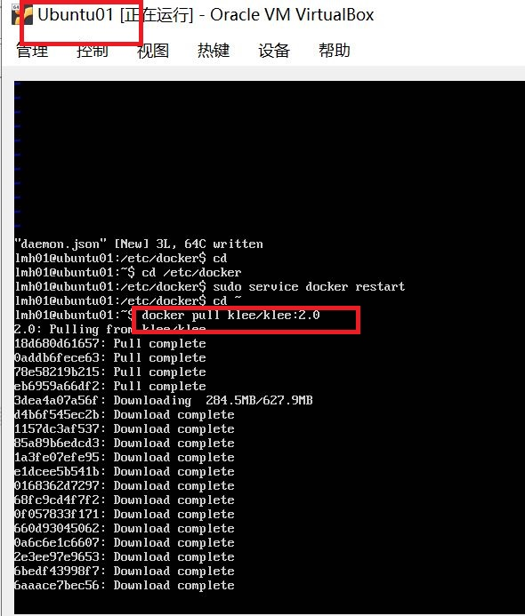  
- 创建KLEE Docker容器的几种方法
    ```
    # 创建一个临时容器 一次性的
    docker run --rm -ti --ulimit='stack=-1:-1' klee/klee:2.0
    # 创建一个长期容器，名为klee_dxy
    sudo docker run -ti --name=klee_dxy --ulimit='stack=-1:-1' klee/klee
    # 退出后可通过名字再次进入
    sudo docker start -ai klee_dxy
    # 删除长期容器
    docker rm klee_dxy
    ```
    
## 实验过程：
- Tutorials One:Testing a small function:
    - 创建一个临时容器(为了测试实验用)
  ```
  docker run --rm -ti --ulimit='stack=-1:-1' klee/klee:2.0
  ```

    - 在klee_src/examples/get_sign目录下的get_sign.c,是用来判断一个整数的正，负，或者为0:
   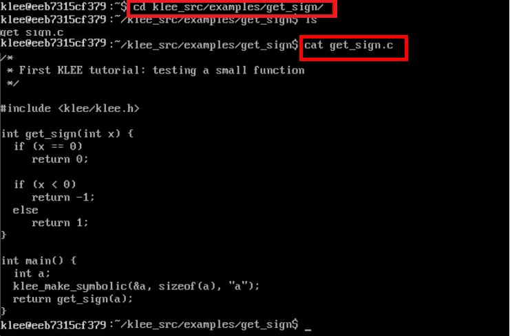
  
   - 因为KLEE是在LLVM字节码上进行工作,所以将将.c编译为LLVM字节码
  ```
  clang -I ../../include -emit-llvm -c -g -O0 -Xclang -disable-O0-optnone get_sign.c
  ```
   - 同目录下会生成一个get-sign.bc的字节码文件，然后进行测试:
   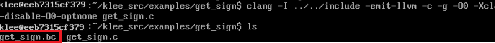
  ```
  klee get_sign.bc
  ```
   - klee-out-0是本次测试结果,klee-last是最新测试结果
   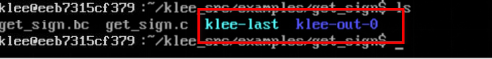
   
   - .ktest文件是KLEE生成的测试用例，是二进制文件，可以用ktest-tool打开
  ```
  cd klee-last
  ktest-tool test000001.ktest
  ```
  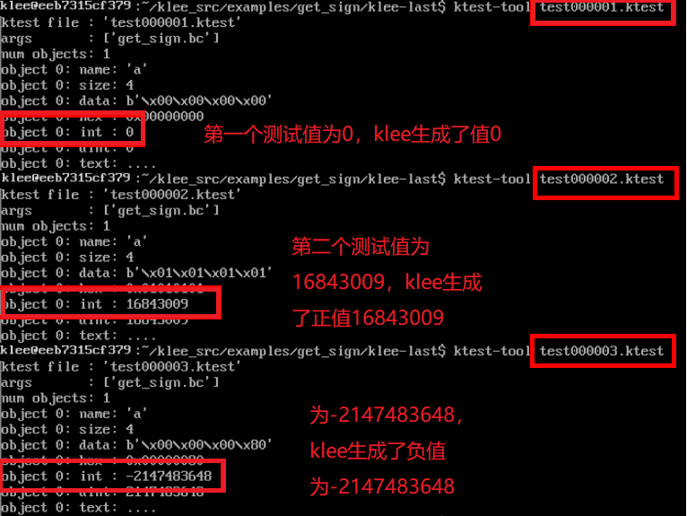
- Tutorial Two: Testing a simple regular expression library:
    - 示例代码`Regexp.c`位于`/home/klee/klee_src/examples/regexp`目录下,先将Regexp.c这个 C 语言文件编译转化为 LLVM bitcode
  ```
  clang -I ../../include -emit-llvm -c -g -O0 -Xclang -disable-O0-optnone Regexp.c
  ```
  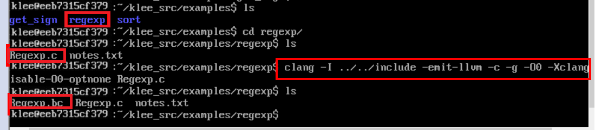   
    - 使用 KLEE 运行代码,发现，代码的23、25行出现了报错:
  ```
  klee --only-output-states-covering-new Regexp.bc
  ```
  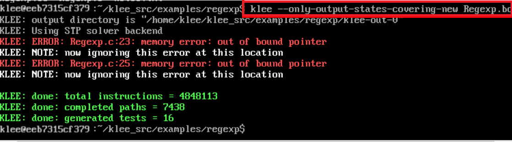   
    - KLEE 在程序执行时发现了错误，生成触发错误的测试用例，并将关于错误的附加信息写入文件`testN.TYPE.err`（`N`是测试样例编号，`TYPE`指明错误类型）
  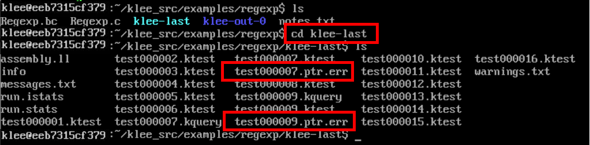   
    - 查看错误信息文件  
  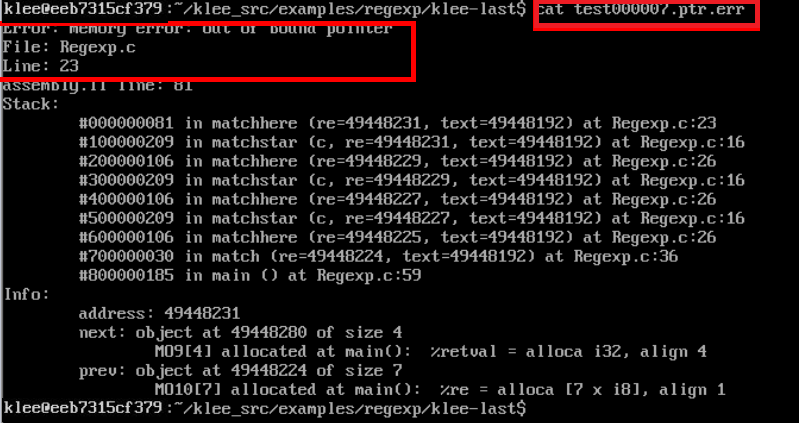      
  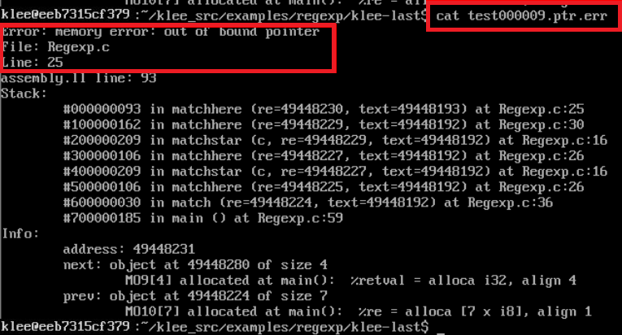   
    - 出现内存错误,输入的正则表达式序列完全是符号的，但是match函数期望它是一个以null结尾的字符串
    - 解决方法：修改代码,将' \0 '符号化后存储在缓冲区的末尾：  
    
  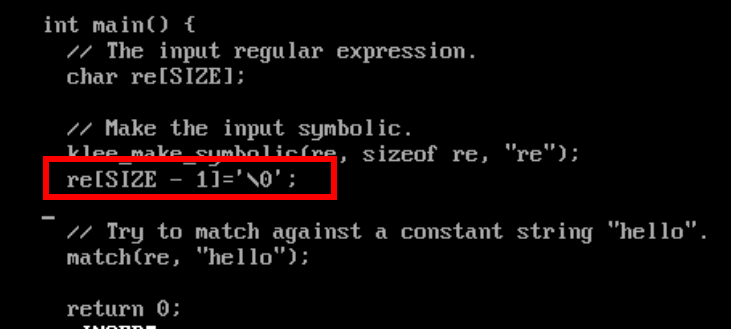 
    - 重新将Regexp.c编译转化为 LLVM bitcode，运行新的Regexp.bc文件,错误消失，执行成功:     
  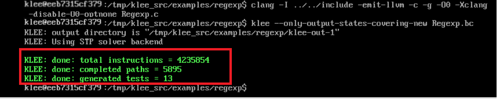  
- Tutorial Three:Solving a maze with KLEE:
    - 该训练显示了如何使用KLEE查找迷宫游戏的所有解决方案
    - 先下载迷宫程序：
  ```
  # Update aptitude 
  sudo apt-get update
  # Install git 
  sudo apt-get install -y git-core
  # Download maze 
  git clone https://github.com/grese/klee-maze.git ~/maze
  # Build & Run Maze
  # Source is in maze.c.
  cd ~/maze
  #Build: 
  gcc maze.c -o maze
  #Run manually: 
  ./maze #执行maze
  # 此时命令行会等待输入，输入如下
  # 表示移动命令 w (up), d (right), s (down), a (left)ssssddddwwaawwddddssssddwwww
  ```   
   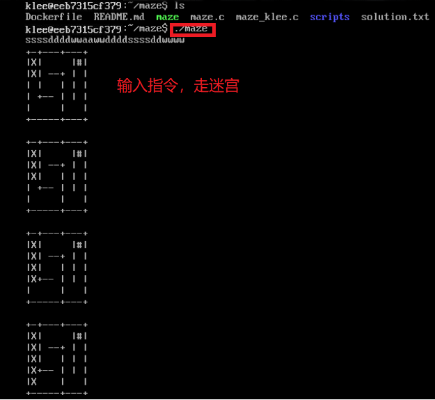      
   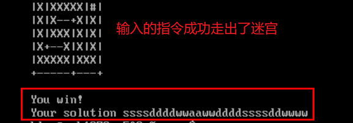    
    - 修改源代码，把用户手动输入改为符号测试，将read调用改成klee_make_symbolic，增加一个`klee_assert(0);`,每次成功就会又一次assert： 
   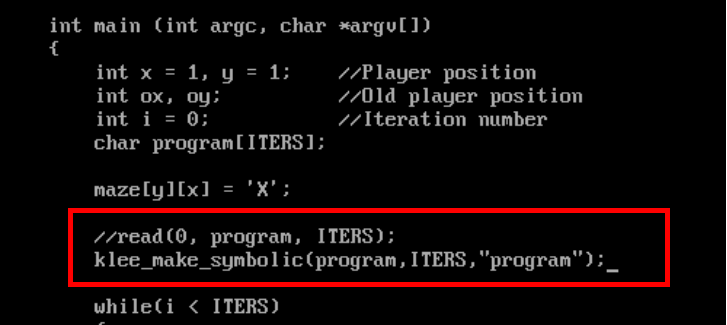    
   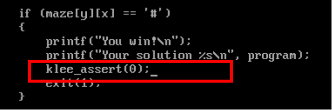    
    - 对修改后的源文件进行编译测试，得到所有成功以及失败的例子：
    
  ```
  # Build & Run Maze w/Klee
  # The maze program using Klee symbolic execution and assertions. When klee evaluates the maze, it will discover the "actual solution", and any "hidden solutions" (which exist due to "bugs" in the maze). 
  # Source is in maze_klee.c
  cd ~/maze
  # Build LLVM Bytecode: 
  ./scripts/build_bc.sh 
  (builds "maze_klee.bc" using "clang -emit-llvm") 
  # Ignore the "implicit declaration of function '__assert_fail'" warning.
  # Run Klee on Bytecode: 
  ./scripts/run_klee.sh 
  (runs klee on "maze_klee.bc" using "--emit-all-errors")
  # Show solutions: 
  ./scripts/show_solutions.sh 
  (gets klee test results from "ktest-tool", and prints maze solutions)
  ```
  
    - klee符号执行一共有四种结果：
    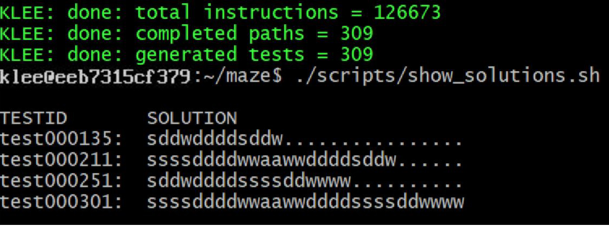


    
## 实验遇到问题及解决：
- [解决Unable to lock directory /var/lib/apt/lists/](https://blog.csdn.net/zmm0420/article/details/100047624)
- [Ubuntu安装软件提示Package has no installation candidate解决方法](https://blog.csdn.net/lsmrsun/article/details/51581448)
- [Ubuntu下载过慢更换下载源](https://blog.csdn.net/weixin_43876206/article/details/100924378)
- [彻底删除docker](https://www.cnblogs.com/shmily3929/p/12085163.html)
- [docker pull拉取镜像失败问题解决](https://blog.csdn.net/qq_37823605/article/details/90666773)
- [Ubuntu 16.4 "W: The repository does not have a Release file." 解决方法](https://blog.csdn.net/weixin_42514606/article/details/105679795)
- [Error response from daemon: Get https://registry-1.docker.io/v2/: net/http: request canceled](https://blog.csdn.net/tripleDemo/article/details/100561776)

## 参考资料：
- [实验报告](https://github.com/Great-Lin999/SoftwareAndSystemSecurity/blob/master/KLEE/KLEE.md)
- [klee-tutorials](https://klee.github.io/tutorials/)

